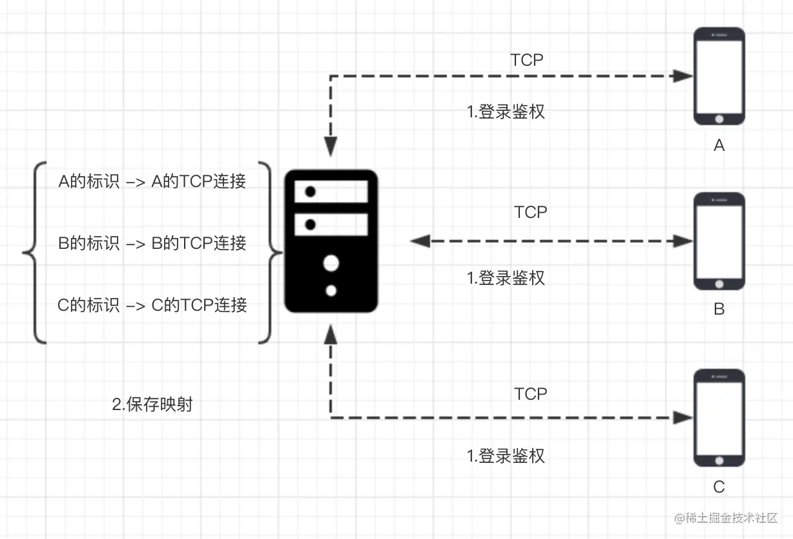
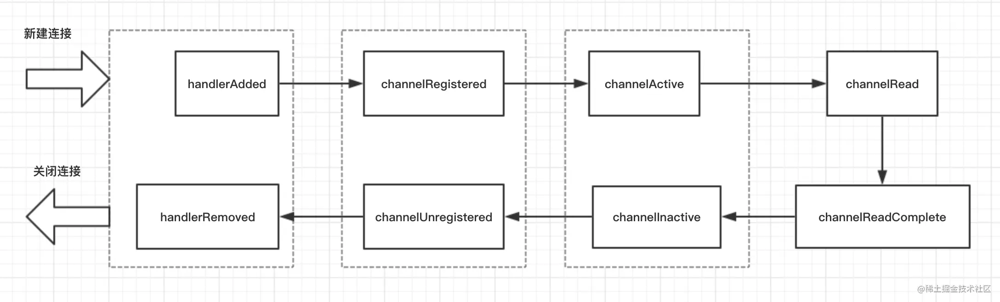

# Netty

IO 概念  实战

NIO 概念  实战

Netty 

那么 Netty 到底是何方神圣？ 用一句简单的话来说就是：Netty 封装了 JDK 的 NIO，让你用得更爽，你不用再写一大堆复杂的代码了。 用官方正式的话来说就是：Netty 是一个异步事件驱动的网络应用框架，用于快速开发可维护的高性能服务器和客户端。

Bootstrap和ServerBootStrap是Netty提供的一个创建客户端和服务端启动器的工厂类，使用这个工厂类非常便利地创建启动类，根据上面的一些例子，其实也看得出来能大大地减少了开发的难度。首先看一个类图：

一般来说，使用Bootstrap创建启动器的步骤可分为以下几步：

ChannelHandler的生命周期：

一对一单聊的原理我们在 仿微信 IM 系统简介:

